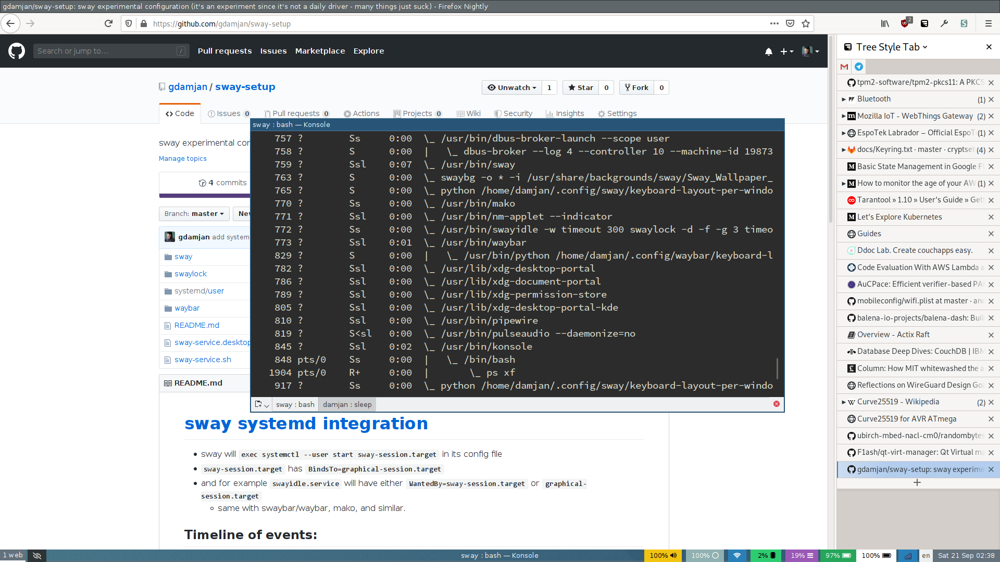

# My Sway setup

[Sway](https://swaywm.org/) is a modern tilling wayland compositor, that emulates i3.
Based on wlroots, it's one of the most featureful wayland compositors.

Still, a lot of things wont work in Wayland.

# [sway systemd integration](https://github.com/swaywm/sway/wiki/Systemd-integration)

I'm running sway as a user systemd service, started by sddm (the login manager).

* `/usr/share/wayland-sessions/sway-service.desktop` is added for a custom wayland session
* when I choose that session in sddm `/usr/local/bin/sway-service.sh` is started, which:
  * loads the sddm/pam environment into the user systemd service manager
  * then starts the sway.service
  * systemd/user/sway.service loads additional environment variables from `~/.config/sway/env`
  * waits for the service to finish, which signals the end of the session
* next, sway initializes and starts running:
  * at the end sway calls `exec "systemctl --user import-environment ; systemctl --user start sway-session.target"`
    * which imports the additional sway env vars back into systemd
  * only then `sway-session.target` is getting started:
    * it has `Wants=graphical-session-pre.target` so any desktop non-gui services starts first
    * then it has `BindsTo=graphical-session.target wayland-session.target`, and any enabled
      gui/wayland and sway applets/services start from there
    * examples are `swayidle.service` which has `WantedBy=sway-session.target` (or `wayland-session.target`)
    * same with swaybar/waybar, mako, and similar.

## Where do environment variables go?

`~/.config/sway/env` variables set for the sway service, but also imported by the systemd --user manager.

## Wayland tools
- https://github.com/gdamjan/swaylock (fork: implements a grace period before a password is required)
- https://gist.github.com/gdamjan/1415d93b83a38f64cffea0ff4c54fc4b (nm-applet with --indicator support)
- https://github.com/kennylevinsen/wldash (runner / dashboard)
- https://github.com/Hummer12007/brightnessctl/
- https://github.com/misterdanb/avizo (notification daemon for volume/backlight)
- https://github.com/cyclopsian/wdisplays (GUI display configurator for wlroots compositors)
- https://github.com/bugaevc/wl-clipboard (Command-line copy/paste utilities for Wayland)
- https://github.com/Alexays/Waybar/pull/85#issuecomment-525223382 (sway-layout script for waybar)

… and [more](https://github.com/topics/sway).

## Also:

I use two python scripts to: show the current keyboard layout in waybar (see `./waybar/keyboard-layout.py`); and
`./sway/keyboard-layout-per-window.py` that implements per-window keyboard layout in sway.
Both require `i3ipc`, install it with: `pip install --user i3ipc`.

# An unordered list of wayland bugs and issues

- all firefox issues https://bugzilla.mozilla.org/show_bug.cgi?id=635134
- ~copy by select / paste with middle click in QT/KDE apps~
  (need to implement [gtk_primary_selection_device_manager](https://bugreports.qt.io/browse/QTBUG-66008)) (qt-5.14)
- ~ctrl-Ц/В doesn't copy/paste in QT/KDE~ https://bugreports.qt.io/browse/QTBUG-65503 (fixed qt-5.13)
- ~utf-8 paste~ https://bugreports.qt.io/browse/QTBUG-54786 (fixed qt-5.13)
- per window/app keyboard layout
  https://github.com/swaywm/sway/pull/3155 (see https://github.com/swaywm/sway/pull/4504/files)
- keyboard layout applet ([waybar](https://github.com/Alexays/Waybar/issues/66), [protocol](https://github.com/swaywm/wlr-protocols/pull/31))

- ~mpv doesn't inhibit screensaver~ (fix is: --gpu-context=wayland)
  should be automatic in mpv > 0.29.1
- ~mpv error: failed to resolve wl_drm_interface(): /usr/lib/libEGL_mesa.so.0: undefined symbol: wl_drm_interface
  libva-intel-driver > 2.3.0~ (fixed in arch packages)

- xmag/zoom - double check font antialiasing
- ~networkmanager applet~ (recompiled `nm-applet --indicator`)
- ~pulseaudio applet~ (waybar kind of)
- bluetooth applet
- kdeconnect applet (and functionality: clipboard, remote control)
- ~KDE/Qt apps style~ (works fine with XDG_CURRENT_DESKTOP=KDE)
- systemd --user support in sway https://github.com/swaywm/sway/pull/3486
- generic screen/window capture (chromecasting, webrtc screensharing, screencasting) - pipewire integration in firefox/chrome
